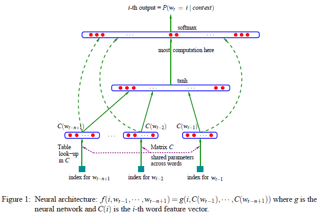
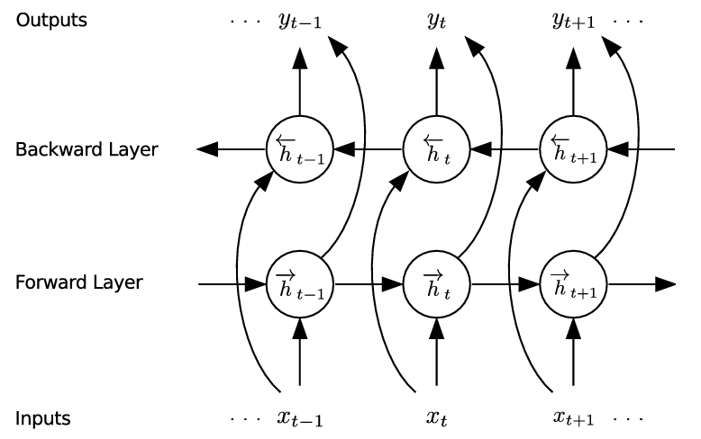
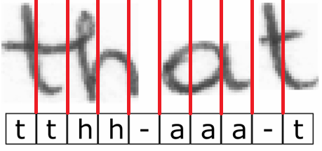
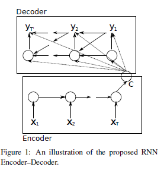
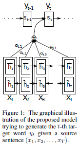
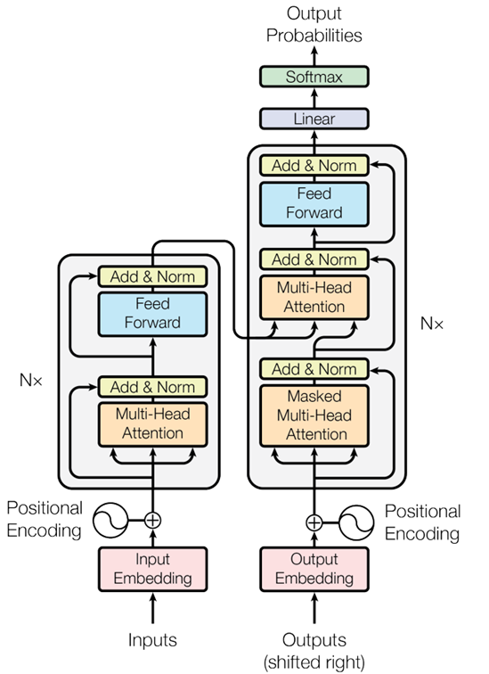
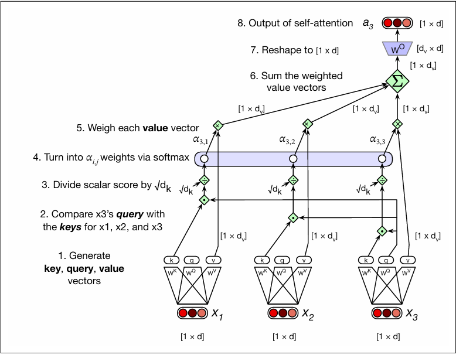
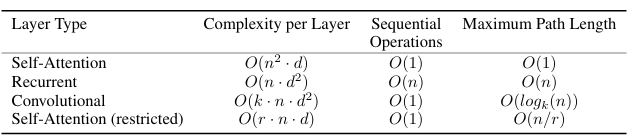

Note: This is my first blog article, I still need to fix things like formatting and references!

Transformers are the backbone of large language models (LLMs) and are the latest iteration of an attempt to solve the sequence-to-sequence ("Seq2Seq") problem. This problem is also sometimes spoken about in terms of *language modeling* when the context is language; a specific example is the machine translation problem which refers to translating between languages. There have been many approaches to solving the Seq2Seq problem but what makes the transformer stand out is that it has the best practical scalability (because it can be parallelized) among known architectures as well as having state-of-the-art accuracy. The goal of this article is to introduce the reader to the Seq2Seq problem, the various approaches which have been used to solve it, and how it led to the development of the transformer.

## 1. The Seq2Seq problem

The Seq2Seq problem is the problem of translating one sequence into another under the assumption that there is a rule for doing this translation. One example is language translation. For instance, one may want to translate the English sentence *I am at peace* to the French sentence *Je suis en paix*. In this example, we can describe the Seq2seq problem in the formal way: let a set of sequences be denoted by $\mathcal{S}$ and let it have grammar $\mathcal{G}$. We denote this set of sequences and grammar by the pair $(\mathcal{S}, \mathcal{G})$. Let there be another set of sequences $\mathcal{S}'$ that has grammar $\mathcal{G}'$, and similarly we denote it by the pair $(\mathcal{S}', \mathcal{G}')$. Assume there is a mapping $f$ which takes $(\mathcal{S}, \mathcal{G})$ to $(\mathcal{S}', \mathcal{G}')$. Then the problem is to learn $f$.

In some Seq2Seq problems, this formulation is not convenient or appropriate. This is the case in image-to-text recognition (often called optical character recognition). In image-to-text recognition, an algorithm learns from pixels, but it is less conceptually helpful to describe a grammar on pixels which make up a word. Thus, the Seq2Seq problem has more than one formulation and it is hard to capture it using one paradigm.

The Seq2Seq problem can also be interpreted as a problem of text generation – you prompt a machine with text, and it maps your text into a sequence which it returns. Thus, a benefit of understanding the Seq2Seq problem is that one can better understand generative AI (e.g. LLMs) from the point of text generation. Before talking in depth about transformers, we shall highlight some of the earlier attempts at solving the Seq2Seq.

## 2. Earlier approaches

We only touch on what I consider to be highlights in the Seq2Seq problem as there is too much literature to cover. Before neural networks, researchers relied on statistical approaches such as Hidden Markov models, n-grams, and other statistical language modeling. We will not discuss these approaches but will instead start with neural networks. Among the earliest approach is Bengio et al., which used a feedforward neural network, although it mentioned the possibility of using a recurrent neural network in the proposed architecture.

  
*Figure 1: Architecture from Bengio et al.*

A groundbreaking result in the Seq2Seq problem happened with connectionist temporal classification (CTC) (Graves et al., 2006). It is a purely neural network (RNN) approach and was more accurate than competing methods of its time (hidden Markov models). It is easiest to understand CTC with an example, in this case image-to-text recognition, one of its motivations along with speech to text transcription. Imagine an image of the word "that" which we would like to transcribe to characters. The image is stored in pixels. Further, imagine that the word is divided into equally sized rectangular blocks along the length of the word. According to CTC, an RNN is trained to output the probability of a label corresponding to each rectangle. The labels are then "collapsed" to form a word using a simple rule which states repeating labels are merged and hyphens (which denote transitions between characters) are removed. Specifically, according to the collapsing rule of CTC the output sequence `tthh-aaa-t` becomes `that`. This collapsing avoids the alignment problem—knowing how to divide the image into appropriately sized rectangles so that the RNN outputs exactly the label to which a rectangle corresponds. Put more simply, given a slicing of an image it is possible for consecutive rectangles to correspond to the same state/letter, hence the need for a collapsing procedure to make sure we only output one state/letter. The last important thing to mention about CTC is that the training process does not require that the rectangles be labeled—the algorithm learns how to label each rectangle, again avoiding the problem of alignment.

  
  

 
*Figure 2: Left: A bi-directional RNN used for image-to-text recognition with CTC. Right: Predictions given by CTC. An input image is divided into rectangles. Each rectangle is some $x_t$ from the bi-directional RNN shown left. The output of CTC gives the most likely label corresponding to the rectangle. The training process does not require that the rectangles are labeled.*

A shortcoming of the original formulation of CTC is that the collapsing step implies that the output sequence must be shorter than the input sequence length. This means that CTC would have a problem with sequences which do not meet this criterion. Graves (2012) does away with this constraint by extending CTC by modeling dependencies between outputs and inputs-outputs. Note that this is something that attention tries to do.

For machine translation, a simple RNN based approach (specifically with Elman recurrent neural networks) with language modeling was used in Mikolov et al. Cho et al. and Sutskever et al. drop statistical language modeling and map an entire input sequence into a fixed length vector with an RNN which is then decoded using another RNN. The RNN decodes the fixed length vector until a stop token is predicted. Kalchbrenner et al. is similar except that it uses convolutions to encode the input sequence, an interesting idea.

  
*Figure 3: Architecture from Cho et al.*

The next milestone in the Seq2Seq problem was Bahdanau et al. which introduced attention and is the predecessor of the transformer. It is a significantly simpler architecture than a transformer, only consisting of an RNN encoder, RNN decoder, and cross-attention. It uses a bi-directional RNN to encode an input sequence. Cross-attention is computed using the current output encoding with the hidden states from the bi-directional RNN, as opposed to a transformer which uses all output encodings at each time step. Perhaps the most important difference between this and the transformer is that recurrent neural networks are not used in a transformer. However, this does not mean that there is no recurrence in a transformer. Although there is recurrence it is just not by the mechanism of an RNN. One can argue that the transformer having recurrence makes it an RNN—a different type of RNN, so in some sense it is a matter of wording. Nonetheless, the lack of an RNN makes transformers faster as we will see later in the subsection titled scaling.

  
*Figure 4: Architecture from Bahdanau et al.*

## 3. Transformers

As we learned in the last section, the predecessor of the transformer is the architecture found in Bahdanau et al. Transformers removed the RNN part (they still have recursion, so it is debatable whether one can call one a recurrent neural network), thereby allowing computations to be done in parallel as opposed to sequentially. The transformer modifies that architecture in several ways, and self-attention is one of them. The transformer from Vaswani et al. is shown below. In the next section we talk more in depth about the transformer but we exclude the positional encodings and the feedforward part of a transformer. Order matters in a sequence, and the job of positional encodings is to take this into account—something which must be done in the absence of an RNN.

<table style="border: none; border-collapse: collapse; width: 100%; margin: 1em auto;">
  <tr style="border: none;">
    <!-- First subfigure column (30% width) -->
    <td style="border: none; width: 40%; text-align: center; vertical-align: top; padding: 0 10px;">
      
    </td>
    <!-- Second subfigure column (30% width) -->
    <td style="border: none; width: 60%; text-align: center; vertical-align: top; padding: 0 10px;">
      
    </td>
  </tr>
</table>

  <strong>Figure 2:</strong> Left: the transformer as introduced in (Vaswani et al., 2017). 
  Right: pictorial representation of single head attention from (Jurafsky & Martin).

### 3.1 Embedding

Sequences are first embedded into vectors whose entries are real values. For instance, assume there is a vocabulary denoted $V$ of size $\vert{}V\vert{}$. Then each element of $V$ is embedded into $\mathbb{R}^{\vert{}V\vert{}}$ by assigning to it an element of the standard basis, i.e., *one-hot* encoding. To be more concrete, if $V=\{\text{"hound"}, \text{"dog"}, \text{"jaguar"}\}$, then an example of a one-hot encoding can be:

$$\text{hound} \mapsto (1,0,0), \quad \text{dog} \mapsto (0,1,0), \quad \text{jaguar} \mapsto (0,0,1)$$

Secondly, a matrix of dimensions $d \times \vert{}V\vert{}$ multiplies these embedded vectors to create an embedding into $\mathbb{R}^{d}$, where $d$ is some chosen dimension. At this point we have our encoding matrix $X$, with row dimension $d$. Each encoded vector $\mathbf{x}_i$ belonging to $X$ is then transformed to a query, key, and value vector by the following:

$$\begin{aligned} \mathbf{q}_i &= W^Q \mathbf{x}_i \\ \mathbf{k}_i &= W^K \mathbf{x}_i \\ \mathbf{v}_i &= W^V \mathbf{x}_i \end{aligned}$$

where $W^Q$ and $W^K$ are $d_k \times d$ matrices and $W^V$ is a $d_v \times d$ matrix. Thus, we have the query, key, and value matrices $Q, K, V$. There is considerable leeway in picking the constants $d, d_k, d_v$. In Vaswani et al., these values are respectively equal to 512, 64, and 64.

### 3.2 Attention

Attention is the heart of transformers and it is a method of determining relationships between elements of a sequence. The idea is that given the current element of a sequence, we would like to know how it "attends" or relates to prior elements of the sequence. Attention is used in predicting the next element of a sequence by weighing the relative importance of prior elements of the sequence. The prediction process involves more than attention, but attention is the part we focus on. *Self-attention* is the computation of attention between elements of the same sequence (e.g. input encoding or output encoding) while *cross-attention* is calculated between elements of the output encodings and the input encodings. In Bahdanau et al., only cross-attention is used. Transformers use self-attention for the input encoding and output encodings. The mathematics is the same whether one calculates self-attention or cross-attention.

In the modern formulation of attention (Vaswani et al.), we compute attention using the concepts of keys, queries, and values. The queries and values correspond to the same sequence. The keys may come from the same sequence as the queries and values, or it may come from a different one. For simplicity, we consider self-attention meaning that the keys, queries, and values come from the same sequence. Then the attention calculations become:

$$\begin{aligned} \text{score}(\mathbf{x}_i, \mathbf{x}_j) &= \frac{\mathbf{q}_i \cdot \mathbf{k}_j}{\sqrt{d_k}} \\ \alpha_{ij} &= \text{softmax}\left(\text{score}(\mathbf{x}_i, \mathbf{x}_j)\right) \\ \mathbf{\text{head}}_i &= \sum_{j} \alpha_{ij} \mathbf{v}_j \\ \mathbf{a} &= \text{concat}(\mathbf{\text{head}}_1, \mathbf{\text{head}}_2, \dots, \mathbf{\text{head}}_{m_q}) W^O \end{aligned}$$

where $\mathbf{\text{head}}_i$ is a $1 \times d_v$ vector and $W^O$ is a $d_v \times d_{\text{model}}$ matrix and $m_q$ is the number of elements of the sequence. For two sequences of length $m_q$ and $m_k$, the matrix formulation for self-attention or cross-attention is:

$$\text{head} = \text{softmax}\left(\frac{Q K^{\intercal}}{\sqrt{d_k}}\right) V$$

where the dimension of $Q$ is $m_q \times d_k$, that of $K$ is $m_k \times d_k$, that of $V$ is $m_k \times d_v$, and that of $\text{head}$ is $m_q \times d_v$. This means that given a query sequence of length $m_q$ and a key sequence of length $m_k$, the matrix operations used to calculate $Q K^{\intercal}$ require $\mathcal{O}(m_q d_k m_k)$ operations, and the operations required to multiply $Q K^{\intercal}$ with $V$ require $\mathcal{O}(m_q m_k d_v)$ operations.

### 3.3 Scaling

As mentioned before, transformers are popular because in practice they scale better than other architectures. If we let $m_q = m_k = n$ and $d_k = d_v = d$, then we have $\mathcal{O}(m_q d_k m_k) = \mathcal{O}(n^2 d)$. Thus, $\mathcal{O}(n^2 d)$ operations are required to predict the next element of a sequence given an input sequence of length $m_q$ and output sequence of length $m_k$. Values computed  during attention are cached for later; thus, these operations do not all need to be repeated each time an output is given by a transformer.Vaswani et al. provides the following overview on how different architectures scale during inference:

  
*Figure 7: Computational complexity for inference on a sequence of length $n$ (from Vaswani et al.).*

From the table, we see that when doing inference, the scaling for "recurrent" attention (i.e. the attention from Bahdanau et al.) is $\mathcal{O}(n d^2)$. This is because if we assume that the length of the input sequence is $\mathcal{O}(n)$, then there are $n$ passes through a recurrent neural network. At each pass, we do a matrix-vector multiplication which takes $\mathcal{O}(d^2)$ time, thus a total time for the algorithm is $\mathcal{O}(n d^2)$. It is mentioned in Vaswani et al. that $n$ is typically smaller than $d$ because sentences are not that long. However, this is not the case for how large language models are trained today. Large language models are trained on sequences of *tokens* (about 1/2 to 3/4 of a word length), but the sequences have thousands of tokens.

A typical dimension for an embedding is 300–5000. Thus, the claim that $n < d$ does not justify why transformers are used, although this was the setting in Vaswani et al. The real benefit comes from the ability to parallelize computations that are done in a transformer. In a bi-directional RNN, an input sequence is given to an RNN whose hidden states in both directions are concatenated. This process is sequential and not parallelizable. However, the attention mechanism used in a transformer is fully parallelizable across sequence length, hence the reason why transformers are faster for training and inference.

## References

